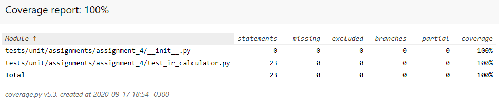
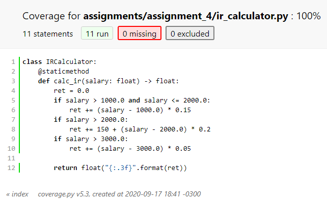
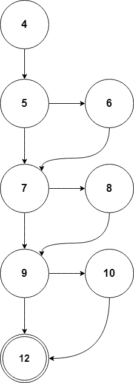

# Assignment 4

## Definition

Build test cases that cover all sentences and branches of the simple IR calculation function code from the following file: https://github.com/otaviolemos/Imposto-de-renda/blob/master/src/imposto-renda. ts

Consider what is no comment as a function of the function.

If you want to use another language, load the code into a language of your choice and create the test cases. Submit the test cases with the report showing 100% coverage of sentences and branches.

### Usage

To test this code run on root folder:

```
$ make tests ARGS="tests/unit/assignments/assignment_4/"
```

To test and generate a terminal coverage report:

```
$ make report ARGS="tests/unit/assignments/assignment_4/"
```

To test and generate a html coverage report (located at htmlcov/ folder on project root):

```
$ make report-html ARGS="tests/unit/assignments/assignment_4/"
```

## Coverage





## GFC

