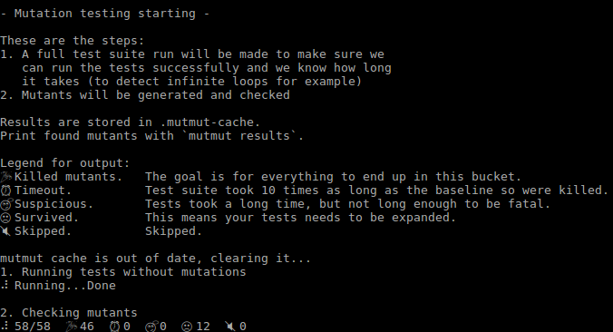

# Assignment 6

## Description

Use a mutation test on a random program.

## Random Program Description

Build a class to classify the damage dealt by a RPG character. The damage scales in 3 different steps and depends on the type of damage.

Physical damage is affected by the 3 steps of damage and the resulting damage is the cumulative bonus plus the initial damage.

Magical damage is only affected by the first and last steps of damage, due to being too overpowered, and the resulting cumulative bonus plus the initial damage.

The three steps of damage are:
- 24.5% of the current damage is added to the total (1000 damage to 2999.99)
- 40% of the current damage is added to the total (3000 damage to 4999.99)
- 15% of the current damage is added to the total (5000 damage and up)

The bonus damage on a certain range is based on the amount on the interval. For exemple, 2000 damage will result on 2245 final damage, 2000 original damage plus (2000 - 1000)*0.245 = 245.

## Results

Using mutmut to run the mutation tests, the result was the following:

